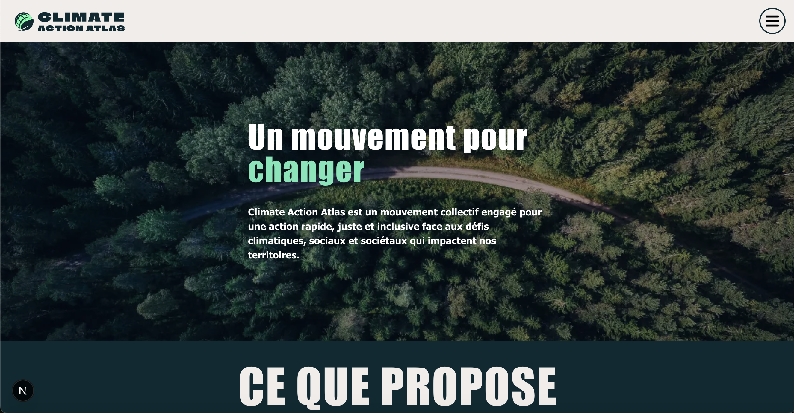
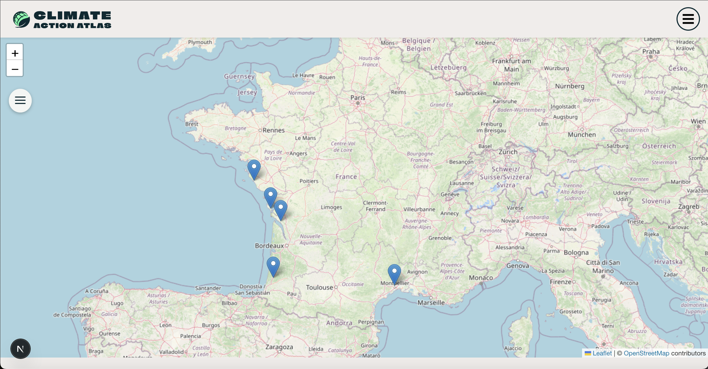

# Climate Action Atlas


## 🔗 Demo

🌍 Accéder à la version en ligne :  
➡️ [Review App Vercel](https://climate-action-atlas-git-main-paularondaos-projects.vercel.app/)  


## A propos du projet

### Cartographier les initiatives dans le monde qui font germer un avenir plus juste et durable.

Climate Action Atlas est une plateforme collaborative et interactive pensée pour cartographier les initiatives locales qui agissent pour une transformation écologique, sociale, artisanale, éducative ou culturelle. Elle s’adresse à toutes celles et ceux qui souhaitent comprendre, s’inspirer et s’engager.

La plateforme permet d’explorer des initiatives partout dans le monde, en naviguant par type d'impact.

Chaque utilisateur·rice peut contribuer à cette cartographie en ajoutant une initiative via un formulaire simple en respectant leur souhait d’être anonymisé·e. Pour cela, la création d'un compte sur la plateforme est nécessaire.


### Tech Stack

- **Client:** NextJs, Typescript, Styled component

- **Server:** Node

- **ORM:** Prisma

- **Backend:** PostgreSQL

- **Environnement:** Docker

- **API:** Base Adresse Nationale (API) et leaflet (carte intéractive)


## Run Locally

Clone the project

```bash
  git clone https://github.com/PaulaRondao/Climate_Action_Atlas.git
```

Go to the project directory

```bash
  cd my-project
```


## Commencement

### Prérequis

- Node.js version **22.x** 
- [NVM](https://github.com/nvm-sh/nvm) (gestionnaire de versions Node)
- Docker 


### Installation

Install dependencies

```bash
$ npm install
```


### Environnement

Créer un ficher .env à la racine du projet

```bash
$ cp .env .env.local .env.sample .env.test
```

Créer un ficher .gitignore et ajouter .env dedans

```bash
$ cp .gitignore
```


### Environment Variables

To run this project, you will need to add the following environment variables to your .env file

`DATABASE_URL`= URL de connexion PostgreSQL

`BETTER_AUTH_SECRET`= clé secret pour Better Auth

`BETTER_AUTH_URL`= URL de base de l'application

---

## Démarrer le projet

```bash
1. Démarrer l'application et la base de données
docker compose up
```

```bash
2. Appliquer les migrations dans le containeur
docker compose exec web npx prisma migrate dev 
```

```bash
4. Générer Prisma Client en local 
npx prisma generate
```

```bash
5. Seeder la base
docker compose exec web npx prisma db seed
```


### Utilisation avec Docker

Pour arrêter la base de données :

```bash
docker compose down
```

Pour vider le volume de la base de données (reset complet de la DB):

```bash
docker compose down -v
```


### Commandes Prisma

```
# Dev (crée/ajuste le schéma en développement)
npx prisma migrate dev 

# Client Prisma (le code TypeScript) soit régénéré
npx prisma generate

# Prod/CI (applique les migrations déjà créées)
npx prisma migrate deploy
```


### Réinitialiser la base (drop + migrate + seed) :

```
docker compose exec web npx prisma migrate reset --force
```


### Créer une nouvelle migration

```
docker compose exec web npx prisma migrate dev --name <un nom parlant de migration>
```

<un nom parlant de migration> c'est par exemple "update-<un nom en lien avec la table>"


### Pour lancer l'éditeur graphique de Prisma

```
docker compose exec web npx prisma studio --port 5555
```

---

## Tests
```bash
# Tests unitaires
npm run test:prisma

# Tests API (nécessite la DB en cours d'exécution)
npm run test:api
```

---

## Build (production ou CI/CD ou création de nouveaux containers Docker)
```bash
npx prisma generate && npx next build
```

---

## Déploiement
```bash
npm run deploy
npx prisma migrate deploy
```


## Roadmap
- [ ] Affichage des initiatives sur une carte intéractive
- [ ] Affichage des initiatives via une liste
- [ ] Filtre avancé par type d'impact
- [ ] Page de profil contributeur avec ses initiatives
- [ ] API publique pour accéder aux données


## Screenshots



